# AI Spec Harness (MPHarness)

This repository contains the AI Spec Harness, a CLI tool and template system designed to enforce a strict, specification-driven development workflow for AI coding assistants. 

It prevents AI agents from guessing requirements, writing untested code, or losing context during complex multi-agent parallel execution.

## Features
- **Zero Assumptions:** The AI is strictly instructed to never guess requirements or "vibe code" without clear specs.
- **Resource-Aware Orchestration:** Guidelines for safe parallel agent execution, preventing merge conflicts and resource saturation.
- **English First:** All code, variables, commits, and documentation must be exclusively in English.
- **Living Documentation:** Automatic maintenance of `TASKS.md`, `MANUAL.md`, and `TRACKING.md`.
- **Testing Enforcement:** Mandatory UI visual validation and pragmatic testing strategy.

## AI Workflow & Lifecycle

The following diagram illustrates the complete lifecycle and the strict methodology (Spec-Driven) that an AI agent follows when operating within an MPHarness-governed project.

```mermaid
flowchart TD
    %% Styles
    classDef userReq fill:#2b5c8f,stroke:#fff,stroke-width:2px,color:#fff
    classDef govern fill:#4a148c,stroke:#fff,stroke-width:2px,color:#fff
    classDef spec fill:#00695c,stroke:#fff,stroke-width:2px,color:#fff
    classDef orchestrate fill:#e65100,stroke:#fff,stroke-width:2px,color:#fff
    classDef execute fill:#1565c0,stroke:#fff,stroke-width:2px,color:#fff
    classDef final fill:#2e7d32,stroke:#fff,stroke-width:2px,color:#fff

    %% Nodes
    Start(["Session Start"])
    Audit["Limbo Audit & Continuous Governance<br>(Review CONSTITUTION, git status)"]
    Req["User Requests a New Feature"]
    SpecCheck{"Is the request<br>logically viable?"}
    Pushback["Pushback Protocol:<br>Reject with evidence"]
    WriteSpec["1. Document the WHAT in SPECIFICATION.md"]
    WriteTasks["2. Document the HOW in TASKS.md"]
    WaitApprove["Wait for User Approval<br>(Coding is strictly forbidden before this)"]
    Measure["Dynamic Resource Measurement<br>(Current RAM/CPU)"]
    Collision{"Collision Analysis:<br>Do tasks touch the same<br>global/serialized files?"}
    LogPre["Pre-Delegation Logging:<br>Log assignment in TASKS.md"]
    SpawnParallel["Parallelize:<br>Spawn Multiple Subagents"]
    SpawnSeries["Sequential:<br>Run 1-by-1 to avoid<br>'false reds'"]
    Code["Write Code (Component-Level)"]
    Commit["Early Commit<br>(BEFORE verification)"]
    Verify["Exhaustive Verification<br>(Tests / Visual Validation)"]
    Fail{"Does Verification Fail?"}
    Rollback["Self-Correction Loop / Rollback"]
    Track["Update TRACKING.md"]
    Archive["Auto-Maintenance:<br>Package tasks into /archive/vX.md"]
    Done(["Phase Completed - Waiting for next instruction"])

    %% Connections
    Start --> Audit
    Audit --> Req
    Req --> SpecCheck
    SpecCheck -- Inviable --> Pushback
    Pushback --> Req
    SpecCheck -- Viable --> WriteSpec
    WriteSpec --> WriteTasks
    WriteTasks --> WaitApprove
    WaitApprove --> Measure
    
    Measure --> Collision
    Collision -- No Collision --> LogPre
    Collision -- Collision Detected --> SpawnSeries
    LogPre --> SpawnParallel
    
    SpawnParallel --> Code
    SpawnSeries --> Code
    
    Code --> Commit
    Commit --> Verify
    Verify --> Fail
    Fail -- Yes (Max 3 attempts) --> Rollback
    Rollback --> Code
    Fail -- No (Green) --> Track
    
    Track --> Archive
    Archive --> Done

    %% Apply Classes
    class Req,WaitApprove userReq
    class Audit,Pushback govern
    class SpecCheck,WriteSpec,WriteTasks spec
    class Measure,Collision,LogPre,SpawnParallel,SpawnSeries orchestrate
    class Code,Commit,Verify,Fail,Rollback execute
    class Track,Archive,Done final
```



### Workflow Phases Explained:
1. **Governance (Purple):** At the start of every session and before any instruction, the AI self-audits against the Constitution. If you request something technically unfeasible, the *Pushback Protocol* engages.
2. **Spec-Driven (Teal):** The golden rule. It is strictly forbidden to write code without first documenting the "What" and the "How", and obtaining your explicit approval.
3. **Orchestration (Orange):** The AI measures the actual RAM available at that exact moment and analyzes file collisions to intelligently decide whether to run tasks in parallel or sequentially.
4. **Execution (Blue):** Note how the *Early Commit* happens BEFORE verification. This ensures that if a heavy test suite crashes the system, your code is already safely stored in Git.
5. **Closure (Dark Green):** The changelog is updated and the AI automatically performs cleanup, archiving the completed historical tasks to `/archive/`, leaving a clean slate for the next feature.

## How to Use the Harness

You **do not** need to manually copy the template folders into your new projects. The harness comes with a built-in CLI to automatically bootstrap any directory.

### 1. Installation
Ensure you have Python installed. The project uses `uv` for dependency management.
From the root of this repository (`MPHarness`), run the bootstrap script for your OS:
- **Windows:** `.\harness.ps1`
- **Mac/Linux:** `./harness.sh`

This will validate your environment and install the `harness` CLI tool.

### 2. Initializing a Project
Navigate to your target project folder (it can be empty or an existing project) and run:

```bash
harness init
```

This command will automatically generate all the required AI templates (`CONSTITUTION.md`, `SPECIFICATION.md`, `AGENTS.md`, etc.) in that directory. 
**Important:** The command also creates a `/docs` folder. If you have any initial requirements, analysis documents, or UI prototypes, **place them inside `/docs`** before inviting the AI. The AI is strictly instructed to look for requirements there.

### 3. Start Working with the AI
Once initialized and your initial files are placed in `/docs`, open the project in your AI IDE or prompt your agent to look at the folder.
The first thing the AI will do is read the `AGENTS.md` directives and adapt to the strict workflow. 

- **If it's a new project without requirements:** The AI will start a brief "vibecoding" interview with you to build the `SPECIFICATION.md` before writing any code.
- **If it's an existing project:** The AI will run a system audit (checking for orphaned git branches and uncommitted work) before continuing.

### 4. Validating the Harness
To ensure all required files are present and properly tracked by the AI, you can run:
```bash
harness check
```

### 5. Updating the Harness
As the central MPHarness repository evolves, updates can be pulled directly from the GitHub repository into your active projects **without overwriting your custom rules**:
```bash
harness update
```
*(Note: If you run this manually, it downloads to `.harness/updates/`. However, your AI Agent is instructed to run `harness update --auto` automatically in the background when it starts. If updates are found, it will ask for your permission to merge them safely.)*

## 6. Workflow Scenarios

Here is how to use the harness in practice:

### Scenario A: Starting a 100% New Project
**Goal: Extract ideas and plan before coding.**
1. Create an empty folder (e.g., `mkdir MyNewApp` and `cd MyNewApp`).
2. Run `harness init`. The CLI will create the `/docs` folder and all markdown templates.
3. Save any ideas, raw requirements, or sketches inside `/docs`.
4. Open your AI IDE and say: *"I have an idea for an app, please check `/docs` and let's start."*
5. **AI Behavior:** The agent will read `CONSTITUTION.md` and `AGENTS.md`, see it's a new project, and enter an interview mode to build `SPECIFICATION.md` and `ARCHITECTURE.md`. It will not write code until you approve the plan.

### Scenario B: Working on an Ongoing Project (WITH the Harness)
**Goal: Resume work and check for harness updates safely.**
1. Open the project in your AI IDE and ask for your next feature (e.g., *"Add the payment gateway."*).
2. **AI Behavior (Startup Audit & Update):** Before doing anything, the agent will run `harness update --auto` to check for new rules on GitHub. If updates exist, it will ask: *"There are harness updates available. Do you want to apply them now?"*. If approved, it merges them, runs a verification test, and performs a rollback if it fails.
3. It then reads `TASKS.md` and the Git history to understand the current state before addressing your request.

### Scenario C: Working on an Ongoing Project (WITHOUT the Harness)
**Goal: Tame a chaotic or legacy codebase.**
1. Open your terminal in the existing project folder and run `harness init`. (This won't alter your code).
2. Open your AI IDE and say: *"I just injected the AI harness. Please audit this project and fill in the specifications."*
3. **AI Behavior:** The agent reads the constitution, reverse-engineers your existing codebase to identify the stack, and fills out `ARCHITECTURE.md` and `SPECIFICATION.md`. From that moment on, the project is governed by the strict harness rules.
